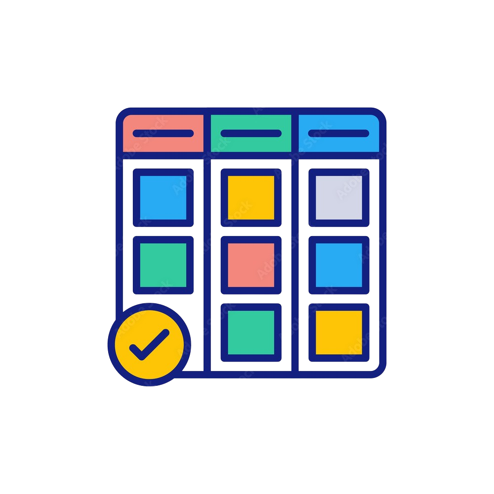

# Kanban Board React App

**Kanban Board** application built with React, providing an intuitive interface for managing tasks and containers. Users can create, edit, and delete tasks (cards) and containers seamlessly.

## Screenshots

Here are some screenshots of the application in action:




---

## Features

- Add, edit, and delete containers.
- Add, edit, and delete cards within containers.
- Responsive design for both desktop and mobile screens.
- Smooth transitions and user-friendly modals for creating and editing.
- Context API for managing the state of containers and cards.
- Organized project structure with reusable components.

---

## Tech Used

- **React**
- **TypeScript**
- **Redux** (for state management)
- **Context API**
- **Tailwind CSS**
- **Vite**
- **Shadcn UI**

## Getting Started

Follow the instructions below to set up and run the project on your local machine.

### Prerequisites

Make sure you have the following installed:

- **Node.js** (v14 or later) - [Download here](https://nodejs.org/)
- **npm** or **yarn** (Package manager, included with Node.js)

---

## Installation

1. Clone the repository to your local machine:

   ```bash
   git clone https://github.com/your-username/kanban-board.git
   cd kanban-board
   ```
